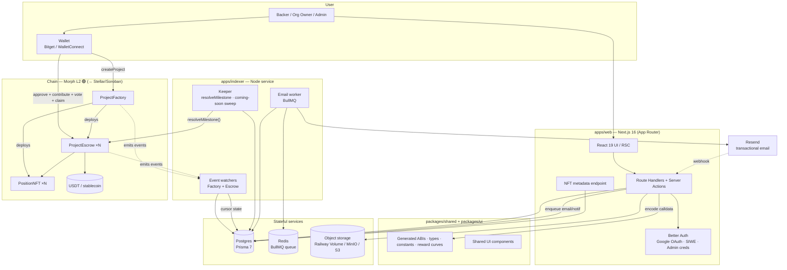
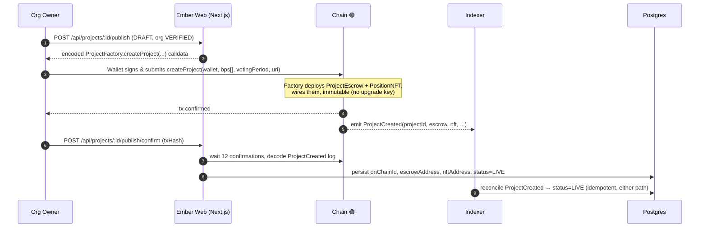
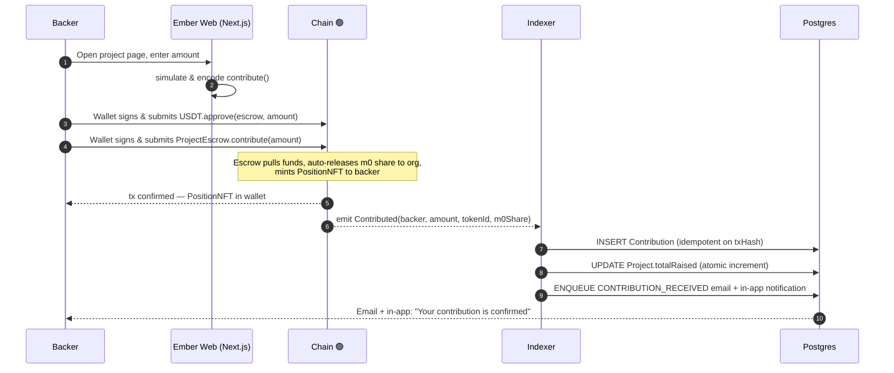
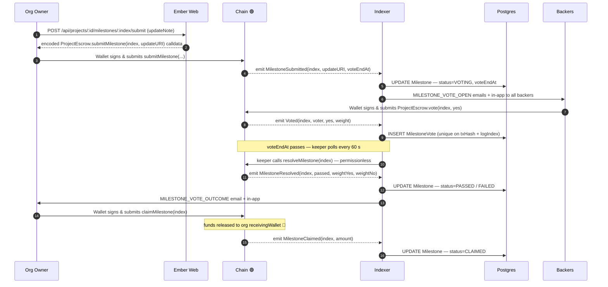

# Ember

> A better Kickstarter — milestone-based, trust-minimized crowdfunding, on-chain.

**Ember is a crowdfunding platform that fixes the single biggest failure mode of traditional crowdfunding: creators collecting money up front and then disappearing.** Instead of releasing funds on day one, every contribution is held in a dedicated, non-custodial **escrow smart contract** and released to the organization **only when backers approve each milestone by on-chain vote**, weighted by how much each backer contributed. Every contribution mints a **position NFT** as portable, inspectable proof of stake; funds move only through on-chain actions (Ember never takes custody); milestone 0 auto-releases on contribution to fund kickoff; and mainstream users onboard with **Google login** plus a connected wallet and back projects in a **stablecoin**. Organizations are vetted (manually verified by a platform admin) before they can publish, and an off-chain indexer mirrors every on-chain event into a database that powers dashboards, notifications, and an append-only audit trail.

**Impact on the Stellar ecosystem (strategic direction).** Ember is a production-grade dApp today on **Morph L2** and is being migrated to **Stellar / Soroban** (tracked in [#177](https://github.com/webnxt-2030/ember2/issues/177), design in [`docs/stellar-strategy`](#roadmap--migration-to-stellar)). On Stellar, Ember becomes a purpose-built engine for the metrics the network cares about most: it drives **stablecoin (USDC) settlement volume** through escrowed contributions and milestone payouts, activates **net-new wallets** for non-crypto backers via passkey smart wallets, and — by integrating **anchors** (fiat on/off-ramps such as Coins.ph for the Philippines), the **Stellar Disbursement Platform** for bulk payouts, and **path payments** so backers can pay in any asset while escrows always accumulate USDC — turns real-world remittance and diaspora-giving flows into on-chain activity. Accountable, milestone-gated crowdfunding is a category Stellar's ecosystem does not yet have, making Ember a strong fit for **Stellar Community Fund** support and a concrete "real-world impact" use case for the chain's payments-and-RWA thesis.

## Demo

<a href="https://www.youtube.com/watch?v=MRD01uWmae4" target="_blank" rel="noopener noreferrer">
  
</a>

▶️ <a href="https://www.youtube.com/watch?v=MRD01uWmae4" target="_blank" rel="noopener noreferrer">Watch the demo on YouTube</a>

---

## Table of Contents

- [What problem Ember solves](#what-problem-ember-solves)
- [System Architecture](#system-architecture)
- [Sequence Diagrams](#sequence-diagrams)
- [Smart Contract Architecture](#smart-contract-architecture-morph-l2)
- [Feature Status](#feature-status)
- [Tech Stack](#tech-stack)
- [Getting Started](#getting-started)
- [Funding Your Wallet (Testnet)](#-funding-your-wallet-with-mock-usdt-morph-hoodi-testnet)
- [Roadmap — Migration to Stellar](#roadmap--migration-to-stellar)
- [Documentation](#documentation)

---

## What problem Ember solves

Backers on traditional crowdfunding platforms (Kickstarter, GoFundMe, Indiegogo) have **no enforceable recourse** if a creator disappears after collecting funds. Money is released up front; trust is a promise, not a guarantee.

Ember replaces that promise with code:

| Traditional crowdfunding | Ember |
| --- | --- |
| Funds released to creator immediately | Funds held in a per-project on-chain **escrow**; released per milestone |
| No accountability after funding | Each release is gated by a **backer vote weighted by contribution** |
| Opaque platform custody | **Non-custodial** — funds only move via on-chain actions |
| No proof of participation | Each contribution mints a **position NFT** |
| Trust the platform | Trust the immutable, no-upgrade-key contract |

---

## System Architecture

Ember is a pnpm monorepo. The web app builds calldata and reads chain state; **the user's wallet signs and submits every value-moving transaction**; a standalone indexer mirrors the resulting on-chain events back into Postgres, runs a permissionless keeper, and drives the email/notification pipeline.



**Key architectural properties**

- **Non-custodial by construction.** Ember's backend never holds a private key that can move backer funds. It only *encodes* transactions; the user's wallet signs. The keeper key (`resolveMilestone`) is permissionless and holds only gas.
- **Chain is the source of truth.** The database is a read-mirror. Every write path is idempotent (keyed on `txHash` / `txHash+logIndex`) and only committed after `INDEXER_CONFIRMATIONS` (default 12) to survive re-orgs.
- **Immutable contracts.** Each project gets its own `ProjectEscrow` + `PositionNFT` with no upgrade key. Fixing a bug means deploying a new project, never mutating an existing one.

---

## Sequence Diagrams

All value-moving steps happen **on-chain** (🟢). Ember's web app only builds calldata and reads on-chain state; the user's wallet signs and submits every transaction, and the indexer mirrors the resulting events back into Postgres.

### 1 · Project creation

An org owner publishes a `DRAFT` project. The `ProjectFactory` deploys a dedicated `ProjectEscrow` + `PositionNFT` pair and emits `ProjectCreated`.



### 2 · Backer contributes to a project

The backer approves the stablecoin and calls `contribute()` on the project's escrow; the escrow pulls funds, auto-forwards the milestone-0 share to the org, and mints a `PositionNFT`.



### 3 · Milestone submit → vote → release

The org submits proof, backers vote weighted by contribution, the permissionless keeper resolves the milestone after the window closes, and on a `PASSED` result the org claims funds.



**Resolution rule:** a milestone `PASSES` unless a strict majority of contribution weight votes NO — i.e. `passed = weightNo * 2 < totalContributed`. Abstentions count as YES. If it `FAILS`, funds stay locked until the org resubmits; there is no timeout and no automatic refund (v1 founder decision).

---

## Smart Contract Architecture (Morph L2)

Every project gets its own **immutable** `ProjectEscrow` + `PositionNFT` pair deployed by a singleton `ProjectFactory`. Contracts have no upgrade key — once deployed, the rules are fixed. Built with Solidity `^0.8.28` and OpenZeppelin v5.

```
ProjectFactory (singleton)
│
├─ createProject(orgWallet, milestoneBps[], votingPeriod, projectURI)
│      └─ deploys ──▶  ProjectEscrow   (one per project, immutable, no upgrade key)
│                      │  ├─ contribute(amount)            stablecoin in → PositionNFT minted, m0 auto-released
│                      │  ├─ submitMilestone(index, uri)   org only
│                      │  ├─ vote(index, yes)              backers only, weighted by stake
│                      │  ├─ resolveMilestone(index)       permissionless, after voteEndAt
│                      │  ├─ claimMilestone(index)         org only, after PASSED → funds out
│                      │  └─ votingPowerOf(address)         view — weight = amount contributed
│                      │
│                      └─ deploys ──▶  PositionNFT (ERC-721)
│                                       └─ tokenURI → /api/nft/:contract/:tokenId
│
└─ emits ProjectCreated(projectId, organization, creator, escrow, nft, bps[], votingPeriod)
         └─ indexed by Ember Indexer → sets Project status=LIVE
```

**Events** (mirrored into Postgres by the indexer): `ProjectCreated`, `Contributed`, `MilestoneSubmitted`, `Voted`, `MilestoneResolved`, `MilestoneClaimed`.

| Contract | Responsibility | Key trait |
| --- | --- | --- |
| `ProjectFactory` | Deploys and wires each project's escrow + NFT; assigns `projectId` | Singleton, immutable |
| `ProjectEscrow` | Holds funds, runs contributions / weighted voting / milestone release | One per project, no upgrade key, `nonReentrant` on value paths, `SafeERC20` |
| `PositionNFT` | ERC-721 minted to backers as transferable proof of stake | Escrow wired once via `initEscrow` |

### Deployed contracts (Morph Hoodi testnet)

| Contract | Address | Explorer |
| --- | --- | --- |
| `ProjectFactory` | `0xaC88386f2CC91BaB145e0A6973Bde0f898b572dC` | [View](https://explorer-hoodi.morph.network/address/0xaC88386f2CC91BaB145e0A6973Bde0f898b572dC) |
| USDT (test token) | `0x37Db08F61B00Fd6FcCc1dD9A7200958161992D9D` | [View](https://explorer-hoodi.morph.network/address/0x37Db08F61B00Fd6FcCc1dD9A7200958161992D9D) |

Configure via environment variables:

```bash
# apps/indexer
FACTORY_ADDRESS=0xaC88386f2CC91BaB145e0A6973Bde0f898b572dC

# apps/web
NEXT_PUBLIC_FACTORY_ADDRESS=0xaC88386f2CC91BaB145e0A6973Bde0f898b572dC
NEXT_PUBLIC_USDT_ADDRESS=0x37Db08F61B00Fd6FcCc1dD9A7200958161992D9D
```

---

## Feature Status

The application is **feature-complete against [`SPEC.md`](./SPEC.md)** across all major surfaces — public site, backer dashboard, org dashboard, super-admin panel, smart contracts, indexer, email, and audit logging. See [`docs/features.md`](./docs/features.md) for the per-endpoint breakdown.

| Area | Status |
| --- | --- |
| Public site (`/`, `/projects`, `/projects/[slug]`, `/organizations/[slug]`, how-it-works, about, legal) | ✅ Complete |
| Auth — Google OAuth, SIWE wallet linking, seeded super-admin | ✅ Complete |
| Backer dashboard — contributions, votes, notifications, settings | ✅ Complete |
| Org dashboard — project wizard, publish, milestones, submit, claim, settings | ✅ Complete |
| Super-admin — orgs, users, projects, audit logs (+CSV), emails (+retry), reports | ✅ Complete |
| Smart contracts — factory, escrow, position NFT + Foundry unit/fuzz/invariant tests | ✅ Complete |
| Indexer — event watchers, 12-conf re-org safety, cursor backfill, keeper, coming-soon sweep | ✅ Complete |
| Email — all 10 templates, BullMQ worker, Resend webhook, per-template preferences | ✅ Complete |
| NFT metadata endpoint, file upload/serving, in-app notifications | ✅ Complete |

**Known gaps / follow-ups** (tracked for polish, none block the core flow):

- Indexer does not yet write `ActivityLog` rows for chain-derived events (`CONTRIBUTION_RECEIVED`, `MILESTONE_VOTE_CAST`, `MILESTONE_RESOLVED`, `MILESTONE_CLAIMED`) — the audit trail currently omits these; DB/email/notification writes are unaffected.
- `PROJECT_COMPLETED` status is defined but never emitted.
- Admin settings page is read-only (no editable voting-period bounds / featured projects yet).
- No organization-delete capability or admin-triggered manual keeper resolution.
- No Morph Hoodi fork test; `BINARY` reward curve diverges slightly from the spec's literal definition; chain-ID constants (`2910` / `2818` / `2810`) are inconsistent across `constants.ts`, indexer env, and `foundry.toml` and should be reconciled before mainnet.

---

## Tech Stack

- **Frontend/API:** Next.js 16 (App Router, React 19, Turbopack), Tailwind CSS 4, shadcn/ui
- **Database:** Postgres via Prisma 7 (`@prisma/adapter-pg`)
- **Auth:** Better Auth (Google OAuth + admin credentials) and SIWE wallet linking
- **Wallet/chain:** wagmi 3, viem, Reown AppKit (Bitget featured)
- **Email:** React Email + Resend, queued through BullMQ + Redis
- **Storage:** pluggable driver — Railway volume (default), MinIO, or S3
- **Contracts:** Foundry (Solidity `^0.8.28`, OpenZeppelin v5)
- **Deployment:** Railway (web + indexer + Postgres + Redis + Volume)

### Monorepo layout

- **`apps/web`** — Next.js frontend + API (App Router)
- **`apps/indexer`** — Node.js service: mirrors on-chain events into Postgres, runs the keeper, drains the email queue
- **`packages/shared`** — Shared TypeScript types, generated ABIs, constants, reward-curve math
- **`packages/ui`** — Shared UI component library
- **`contracts/`** — Foundry smart contracts (`ProjectFactory`, `ProjectEscrow`, `PositionNFT`)

### Network

Deployed to the **Morph Hoodi testnet** (chain config is env-driven; see `packages/shared/src/constants.ts`).

---

## Getting Started

### Prerequisites

- Node.js 22.x LTS
- pnpm 10.x (`corepack enable && corepack prepare pnpm@latest --activate`)
- Docker (for local services)
- Foundry (for contract builds / ABI generation)

### Install

```bash
pnpm install
```

### Local services

`docker compose up` starts the local stack with host ports shifted off the defaults:

- Postgres (`5434`), Redis (`6380`)
- MinIO (`9100` / console `9101`) — object storage
- MailHog (`1125` SMTP / `8125` UI) — email capture
- Anvil (`8545`) — local EVM node

### Development

```bash
pnpm dev          # runs web + indexer concurrently
pnpm build        # build all packages
pnpm lint         # lint
pnpm typecheck    # typecheck
pnpm test         # run tests
pnpm gen:abis     # rebuild Foundry contracts and regenerate shared ABIs
```

---

## 🚰 Funding Your Wallet with Mock USDT (Morph Hoodi Testnet)

To interact with Ember on the testnet, you will need **Testnet ETH** (for gas) and **Mock USDT**.

### Step 1: Add the Morph Hoodi Network
* **Network Name:** Morph Hoodi
* **RPC URL:** `https://rpc-hoodi.morph.network`
* **Chain ID:** `2910`
* **Currency Symbol:** `ETH`
* **Block Explorer:** `https://explorer-hoodi.morph.network`

### Step 2: Get Testnet ETH (for Gas)
1. Claim testnet ETH from a Morph Hoodi faucet (e.g., via the [Morph Discord](https://discord.com/invite/morphl2) using the `/morph_eth` command in the `#discord-faucet` channel).
2. Or bridge ETH from a supported L1 testnet using the [Morph Testnet Bridge](https://bridge-hoodi.morphl2.io/).

### Step 3: Mint Mock USDT via Remix
Once you have testnet ETH for gas, mint Mock USDT by interacting with the deployed contract through [Remix IDE](https://remix.ethereum.org/):

1. Open Remix, use the **Deploy & Run Transactions** plugin with Environment **Injected Provider — MetaMask** (connected to Morph Hoodi).
2. In the **At Address** field, enter the Mock USDT address `0x37Db08F61B00Fd6FcCc1dD9A7200958161992D9D` and click **At Address**.
3. Call `mint(to, amount)` with your wallet address and an amount. *(6 decimals — 100 USDT = `100000000`.)*
4. Confirm the transaction.

### Step 4: Import Mock USDT to Your Wallet
Add a custom token with address `0x37Db08F61B00Fd6FcCc1dD9A7200958161992D9D`; symbol (`USDT`) and decimals (`6`) auto-populate.

---

## Roadmap — Migration to Stellar

Ember is migrating its on-chain layer and backend integration from Morph L2 to **Stellar / Soroban** to align with Stellar's stablecoin-payments and real-world-impact ecosystem. Tracking issues:

- **[#177](https://github.com/webnxt-2030/ember2/issues/177)** — Migrate backend + smart contracts from Morph to Stellar (`develop` → `develop-stellar`).
- **Ecosystem integration plan** — Soroban escrow + OpenZeppelin **SEP-50** position NFTs; **USDC** as the default asset; **passkey smart wallets** (seedless onboarding) with sponsored fees; **SEP-24 anchors** (e.g. Coins.ph for PHP) for fiat on/off-ramp; **path payments** so backers can pay any asset while escrows accumulate USDC; **Mercury/Goldsky** indexing to replace the custom indexer; and the **Stellar Disbursement Platform** for bulk milestone payouts. See the dedicated GitHub issue for the full research report, integration matrix, and reference links.

While the migration is in progress, `develop` remains the stable Morph baseline and this README describes the currently-deployed (Morph) implementation.

---

## Documentation

- [`SPEC.md`](./SPEC.md) — Full product specification
- [`AGENT.md`](./AGENT.md) — Coding standards and architecture guide
- [`docs/features.md`](./docs/features.md) — Feature-by-feature implementation reference
- [`docs/DEPLOY.md`](./docs/DEPLOY.md) — Deployment guide
- [`docs/SECURITY.md`](./docs/SECURITY.md) — Security checklist and status
- [`RUNBOOK.md`](./RUNBOOK.md) — Operations runbook (backups, keeper, incident response)
- [`BRAND.md`](./BRAND.md) — Brand and design system
