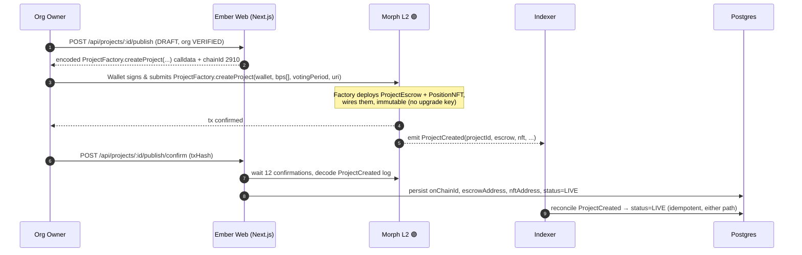
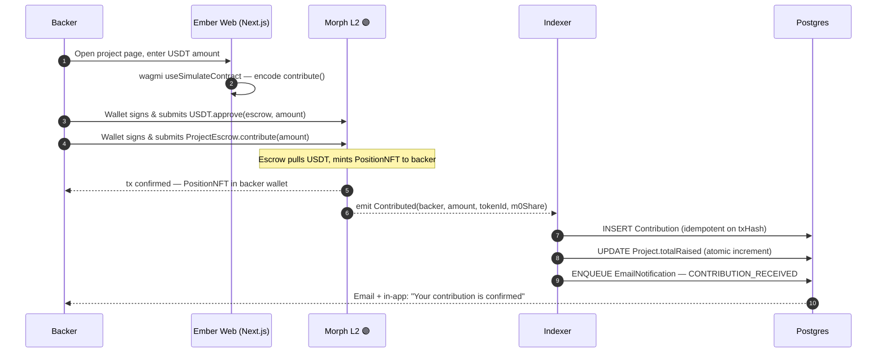
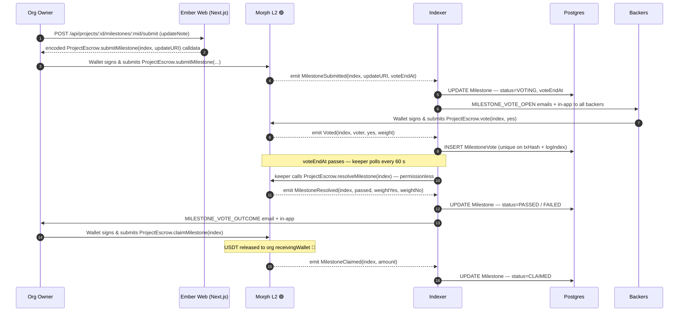

# Ember

> A better Kickstarter.

A milestone-based, onchain crowdfunding dApp on Morph L2.

Backers contribute USDT to escrow contracts and receive an ERC-721 position NFT. Funds release to organizations only when backers approve each milestone by on-chain vote.

## Architecture

- **`apps/web`** — Next.js 16 frontend + API (App Router, Turbopack)
- **`apps/indexer`** — Standalone Node.js service that mirrors onchain events into Postgres, runs the milestone keeper, and processes the email queue
- **`packages/shared`** — Shared TypeScript types, generated ABIs, and constants
- **`packages/ui`** — Shared UI component library
- **`contracts/`** — Foundry smart contracts (`ProjectFactory`, `ProjectEscrow`, `PositionNFT`; Solidity ^0.8.28)

### Tech stack

- **Frontend/API:** Next.js 16 (App Router, React 19), Tailwind CSS 4
- **Database:** Postgres via Prisma 7 (`@prisma/adapter-pg`)
- **Auth:** Better Auth (Google OAuth + credentials) and SIWE wallet linking
- **Wallet/chain:** wagmi 3, viem, Reown AppKit
- **Email:** React Email + Resend, queued through BullMQ + Redis
- **Storage:** pluggable driver — Railway volume (default), MinIO, or S3
- **Contracts:** Foundry (Solidity ^0.8.28)

### Network

Deployed to the **Morph Hoodi testnet** (chain ID `2910`). Chain config (RPC, explorer, USDT address) is env-driven; see `packages/shared/src/constants.ts` for defaults.

#### Deployed contracts (Morph Hoodi testnet)

| Contract | Address | Explorer |
| --- | --- | --- |
| `ProjectFactory` | `0xaC88386f2CC91BaB145e0A6973Bde0f898b572dC` | [View](https://explorer-hoodi.morph.network/address/0xaC88386f2CC91BaB145e0A6973Bde0f898b572dC) |
| USDT (test token) | `0x37Db08F61B00Fd6FcCc1dD9A7200958161992D9D` | [View](https://explorer-hoodi.morph.network/address/0x37Db08F61B00Fd6FcCc1dD9A7200958161992D9D) |

Configure these via environment variables:

```bash
# apps/indexer
FACTORY_ADDRESS=0xaC88386f2CC91BaB145e0A6973Bde0f898b572dC

# apps/web
NEXT_PUBLIC_FACTORY_ADDRESS=0xaC88386f2CC91BaB145e0A6973Bde0f898b572dC
NEXT_PUBLIC_USDT_ADDRESS=0x37Db08F61B00Fd6FcCc1dD9A7200958161992D9D
```

## Features

- **Projects & milestones** — Org owners create draft projects, define milestones (bps-weighted), edit, and publish on-chain via the factory.
- **Contributions** — Backers contribute USDT to a project's escrow and mint a position NFT; NFT metadata is served from `GET /api/nft/[contract]/[tokenId]`.
- **Milestone voting** — Per-milestone YES/NO votes weighted by contribution; the keeper resolves milestones once the voting window closes.
- **Claims** — Org owners claim funds for `PASSED` milestones to their receiving wallet.
- **Dashboards** — Backer dashboard (contributions, votes, notifications, settings) and org dashboard (projects, milestones, settings).
- **Admin panel** — Super Admin tools for users, projects, org verification, audit logs (with CSV export), and the email log.
- **Notifications** — In-app + email notifications across the project/milestone lifecycle, with per-template email preferences.
- **Activity log** — Append-only audit trail on all state-changing paths.

See [`docs/features.md`](./docs/features.md) for the per-endpoint feature breakdown.

## Flows

All value-moving steps happen **on-chain on Morph L2** (🟣). Ember's web app only ever
builds calldata and reads on-chain state; the user's wallet signs and submits every
transaction, and the indexer mirrors the resulting events back into Postgres.

### 1 · Project creation

An org owner publishes a `DRAFT` project. The `ProjectFactory` contract on Morph deploys
a dedicated `ProjectEscrow` + `PositionNFT` pair and emits `ProjectCreated`.



### 2 · Backer contributes to a project

The backer approves USDT and calls `contribute()` on the project's escrow; the escrow
pulls the USDT and mints a `PositionNFT` to the backer's wallet.



### 3 · Milestone submit → vote → release

The org submits proof for a milestone, backers vote weighted by their contribution, the
permissionless keeper resolves the milestone after the window closes, and on a `PASSED`
result the org claims its USDT.



## Smart Contract Architecture (Morph L2)

Every project gets its own **immutable** `ProjectEscrow` + `PositionNFT` pair deployed by a
singleton `ProjectFactory`. Contracts have no upgrade key — once deployed, the rules are
fixed. Built with Solidity ^0.8.28 and OpenZeppelin v5.

```
ProjectFactory (singleton)
│
├─ createProject(orgWallet, milestoneBps[], votingPeriod, projectURI)
│      └─ deploys ──▶  ProjectEscrow   (one per project, immutable, no upgrade key)
│                      │  ├─ contribute(amount)            USDT in → PositionNFT minted
│                      │  ├─ submitMilestone(index, uri)   org only
│                      │  ├─ vote(index, yes)              backers only, weighted by stake
│                      │  ├─ resolveMilestone(index)       permissionless, after voteEndAt
│                      │  ├─ claimMilestone(index)         org only, after PASSED → USDT out
│                      │  └─ votingPowerOf(address)         view — weight = USDT contributed
│                      │
│                      └─ deploys ──▶  PositionNFT (ERC-721)
│                                       └─ tokenURI → /api/nft/:contract/:tokenId
│
└─ emits ProjectCreated(projectId, organization, creator, escrow, nft, bps[], votingPeriod)
         └─ indexed by Ember Indexer → sets Project status=LIVE
```

**Events** (mirrored into Postgres by the indexer): `ProjectCreated`, `Contributed`,
`MilestoneSubmitted`, `Voted`, `MilestoneResolved`, `MilestoneClaimed`.

| Contract | Responsibility | Key trait |
| --- | --- | --- |
| `ProjectFactory` | Deploys and wires each project's escrow + NFT; assigns `projectId` | Singleton, immutable |
| `ProjectEscrow` | Holds USDT, runs contributions / weighted voting / milestone release | One per project, no upgrade key, `nonReentrant` on value paths |
| `PositionNFT` | ERC-721 minted to backers as transferable proof of stake | Escrow wired once via `initEscrow` |

## Getting Started

### Prerequisites

- Node.js 22.x LTS
- pnpm 10.x (`corepack enable && corepack prepare pnpm@latest --activate`)
- Docker (for local services)
- Foundry (for contract builds / ABI generation)

### Install

```bash
pnpm install
```

### Local services

`docker compose up` starts the local stack with host ports shifted off the defaults:

- Postgres (`5434`), Redis (`6380`)
- MinIO (`9100` / console `9101`) — object storage
- MailHog (`1125` SMTP / `8125` UI) — email capture
- Anvil (`8545`) — local EVM node

### Development

```bash
pnpm dev
```

### Build

```bash
pnpm build
```

### Lint & Typecheck

```bash
pnpm lint
pnpm typecheck
```

### Test

```bash
pnpm test
```

### Generate contract ABIs

Rebuilds the Foundry contracts and regenerates the shared ABIs:

```bash
pnpm gen:abis
```

## Documentation

- [`SPEC.md`](./SPEC.md) — Full product specification
- [`AGENT.md`](./AGENT.md) — Coding standards and architecture guide
- [`docs/features.md`](./docs/features.md) — Feature-by-feature implementation reference
- [`docs/DEPLOY.md`](./docs/DEPLOY.md) — Deployment guide
- [`docs/SECURITY.md`](./docs/SECURITY.md) — Security checklist and status
- [`RUNBOOK.md`](./RUNBOOK.md) — Operations runbook (backups, keeper, incident response)
- [`BRAND.md`](./BRAND.md) — Brand and design system
